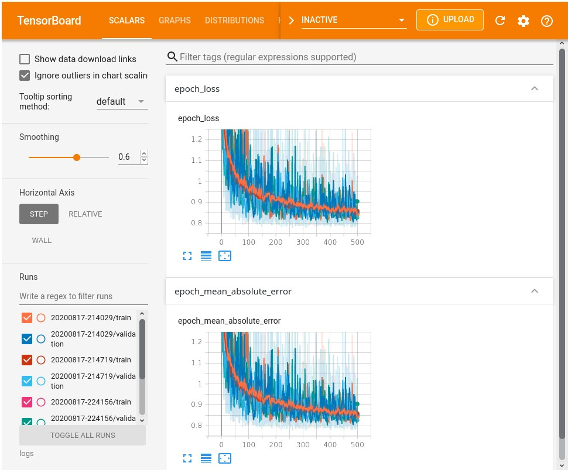
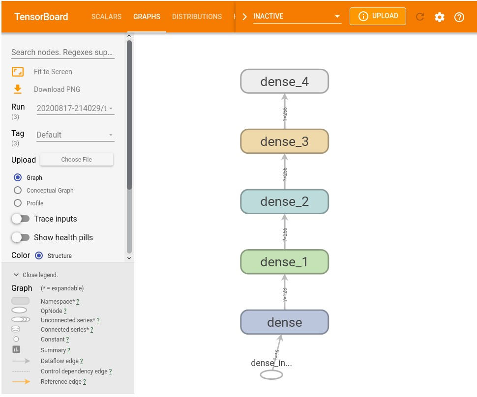

# FIFA-20 PLAYER RATINGS

<h1><strong>INTRODUCTION</strong></h1>

FIFA 20 is a football simulation video game published by Electronic Arts as part of the FIFA series. EA has been making games based on FIFA since 1993. Along with Madden NFL, it forms the backbone of the EA Sports brand. As of 2018, the series had sold over 260 million copies. The latest version in the series FIFA 20, released on 27 September 2019, had 10 million players within two weeks of launch.

<h4><strong>Little Preview </strong></h4>

Every year, ahead of the latest FIFA video game release, EA Sports reveals the FUT (FIFA Ultimate Team) card player ratings sending social media into meltdown. While fans debate the ratings with excitement and fervour, players tag EA Sports in their posts demanding an explanation for their underrated skills. Some are livid, some are embarrassed, some just want their haircut updated. Their ratings are an extension of their ego and they consider a poor round of ratings a slap in the face. Cristiano Ronaldo, the five-time Ballon d'Or winner, when presented with his 93-rated FIFA 20 card last year, scribbled out his score and replaced it with 100 on a live show.

<h1><strong>DATASET</strong></h1>

The data includes <strong>16,042 observations</strong> and <strong>29 variables</strong>. Only outfield football players i.e. forward, defender and midfielder are included in this dataset. Goalkeepers are not part of analysis because their technical attributes like Reflexes, Diving or Kicking are not consistent with attributes of the other outfield players. The dependent variable is Overall Rating which could be from 0 to 100. The 29 predictor variables are data about players such as their nationality, jersey number, playing position or physical and technical attributes like shooting, stamina, free kick accuracy etc.

<h1><strong>ACKNOWLEDGEMENT</strong></h1>

EA Sports

<h1><strong>MOTIVATION- PREDICITIVE MODEL</strong></h1>

The dataset can be used to develop a statistical model that will be able to predict, as accurately as possible, the FIFA 20 rating of a player using various physical and technical attributes of a footballer. The aim can be to find the model with the least out of sample performance or the least mean square error (MSE) using the tree-based Random Forest technique or any other ML tool. The most powerful player characteristics identified through the statistical analysis can help decipher the common misunderstanding about the player’s rating in FIFA and the beautiful game in general.

<h1><strong>TENSORBOARD VISUALIZATIONS </strong></h1>
<h3><strong>EPOCH LOSS </strong></h3>

<h3><strong>Computational Graph </strong></h3>

